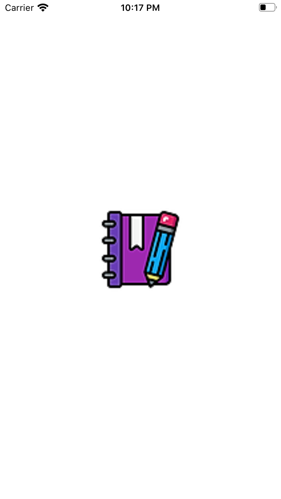
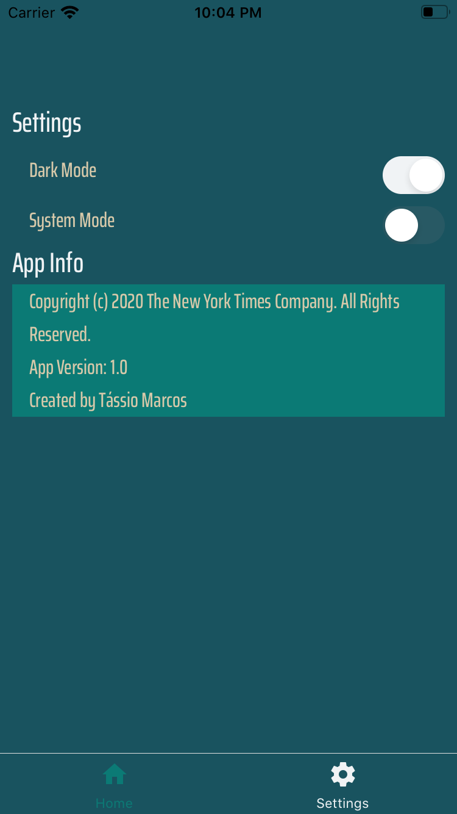
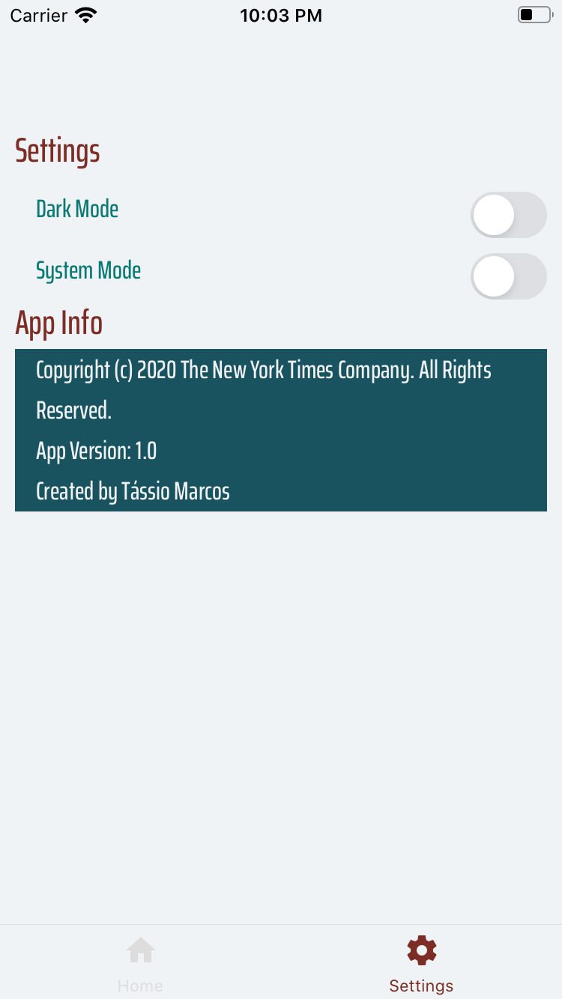

# Desafio React Naitve - Compasso

### Screenshots

#### splash

#### dark

#### light

### Run and Build !?!

- Run DEBUG

  - android:

    - in terminal run yarn, then run 'yarn android'

  - ios:

    - in project folder run 'yarn', then run 'yarn ios'

  * Run RELEASE

    - android:
      - apk: run at the terminal in the root folder the command: 'yarn build:apk'
      - bundle release: run at the terminal in the root folder the command: 'yarn build:bundle'
    - ios:
      - not available

* Make sure you have installed the project packages. Run in terminal 'yarn'.
